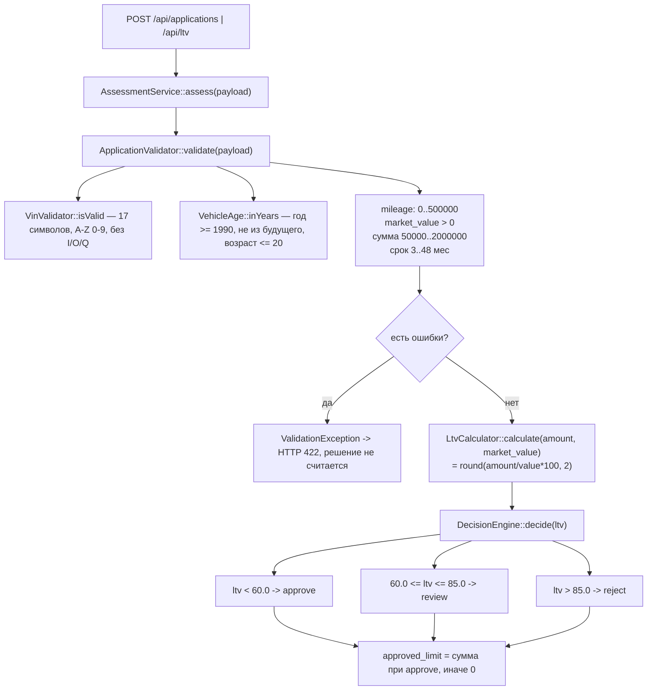

1) Учебный сервис предварительной оценки заявки на заём под ПТС: принимает VIN/год/пробег/стоимость/сумму/срок, считает LTV и возвращает `approve`/`review`/`reject`.
2) `Makefile`: `help`, `up`, `down`, `ps`, `logs`, `install`, `test`, `lint`, `seed`. `docker-compose.yml`: сервисы `backend` (PHP-Slim на :8080) и `db` (MySQL 8), отдельных команд сверх `docker compose up/down/ps/logs` не нашёл — запуск/проверка делаются через `make`.
3) Папка `backend/src/Domain/` (файл `DecisionEngine.php`, пороги берутся из `backend/config/rules.php`).
модель: stg-proxy/training-2026-09-minimax-m3

## Как проверить, что сервис жив

После `make up` сервис слушает на `http://localhost:${APP_PORT:-8080}`.
Готовых make-целей вроде `make health` в проекте нет — используйте любой из способов ниже.

| Способ | Команда | Что показывает |
|---|---|---|
| Эндпоинт здоровья | `curl -sS http://localhost:${APP_PORT:-8080}/health` | HTTP-ответ от приложения; основная проверка |
| Состояние контейнеров | `make ps` (= `docker compose ps`) | что контейнеры `backend` и `db` в статусе `Up` |
| Логи backend | `make logs` | стартовал ли PHP-сервер и нет ли ошибок |
| Healthcheck базы | `docker compose ps db` | у `db` есть `healthcheck` (`mysqladmin ping`); `Up (healthy)` — БД готова |

`make test` и `make lint` код проверяют, а не сам сервис — для liveness используйте строки выше.

code: Создает, изменяет и удаляет файлы, а также выполняет любые bash-команды в терминале для реализации новых функций.

ask: Работает строго в режиме «только чтение», анализирует кодовую базу и отвечает на вопросы без права менять файлы.

plan: Проектирует архитектуру и создает пошаговые инструкции в изолированной папке kilo/plans/, не затрагивая основной код.

debug: Находит причины ошибок, анализирует логи в терминале, запускает тесты и правит код для устранения багов.

---

## Как считается решение approve / review / reject (по `backend/src/Domain/` и `backend/config/rules.php`)

### Участники

| Файл | Роль |
|---|---|
| `backend/config/rules.php` | Все пороги: VIN, авто, сумма, срок, LTV. Код читает значения отсюда |
| `backend/src/AppFactory.php:30–39` | Сборка: `rules.php` раздаётся в `ApplicationValidator` (весь массив), `VinValidator` (`rules['vin']`), `DecisionEngine` (`rules['ltv']`) |
| `backend/src/Domain/AssessmentService.php` | Оркестратор: валидация → LTV → решение |
| `backend/src/Domain/ApplicationValidator.php` | Валидация входа, возвращает нормализованные поля или бросает `ValidationException` |
| `backend/src/Domain/VinValidator.php` | Формат VIN (длина, алфавит, запрещённые символы) |
| `backend/src/Domain/VehicleAge.php` | Возраст авто: `currentYear − productionYear` |
| `backend/src/Domain/LtvCalculator.php` | LTV = сумма / стоимость × 100 |
| `backend/src/Domain/DecisionEngine.php` | Единственное место, где выносится approve / review / reject |
| `backend/src/Domain/ValidationException.php` | Исключение с массивом ошибок `поле => сообщение` |

### Порядок вызовов

Вход — `ApplicationController::create()` / `ltv()` (`backend/src/Http/ApplicationController.php:28, 59`), оба вызывают `AssessmentService::assess($payload)`:

1. **`ApplicationValidator::validate($payload)`** (строки 24–83) — валидация: VIN через `VinValidator::isValid()`, год через `VehicleAge::inYears()`, затем пробег, стоимость, сумма, срок (все пороги — из `rules.php`). Есть ошибки → `ValidationException` → контроллер отдаёт 422, до расчёта решения дело не доходит. Иначе возвращается нормализованный массив `vin, year, mileage, market_value, requested_amount, term_months`.
2. **`LtvCalculator::calculate()`** (`AssessmentService.php:32`) — LTV в процентах с двумя знаками.
3. **`DecisionEngine::decide($ltv)`** (`AssessmentService.php:33`) — пороги `approve_max = 60.0`, `review_max = 85.0`: `ltv < 60.0` → **approve**; `ltv <= 85.0` → **review**; иначе → **reject**.
4. Результат: `vehicle_age` (снова через `VehicleAge::inYears`), `ltv`, `decision`, `approved_limit` (запрошенная сумма при approve, иначе 0).

Замечания по фактам: (1) в комментарии `rules.php:39` и docblock `DecisionEngine` написано `LTV <= approve_max -> approve`, но в коде строгое `$ltv < $this->approveMax` (`DecisionEngine.php:32`) — LTV ровно 60.0 даёт `review`, вопреки комментарию. (2) Справочник `ltv_by_age` в `rules.php:53` заполнен, но в коде нигде не используется — только упомянут в комментарии как несделанная задача LOAN-12.

### Куда встанет правило «пробег ≤ 400 000 км, иначе review»

Решение выносится ровно в одном месте — **`DecisionEngine::decide()`** (`DecisionEngine.php:30`), поэтому правило встаёт туда: внутри `decide()`, **после** LTV-порогов — сначала решение по LTV, затем при пробеге > порога оно принудительно становится `review`. По конвенции проекта (AGENTS.md: «бизнес-числа не хардкодим») порог 400 000 кладётся в `rules.php`, логично — в секцию `vehicle` рядом с `max_mileage_km`.

**Что для этого уже есть:**

- Нормализованный `$input['mileage']` (int) — валидатор его уже возвращает (`ApplicationValidator.php:78`), и он уже доступен в `AssessmentService::assess()` на строке 33, где вызывается `decide()`.
- Конструктор `DecisionEngine` уже принимает конфиг-массив порогов (`DecisionEngine.php:24`) — место для нового порога есть.
- Тесты с полем `mileage` в payload уже существуют (`tests/Unit/AssessmentServiceTest.php:38`, `ApplicationValidatorTest.php:34`).

**Чего не хватает:**

- Пробег не доходит до решателя: `decide(float $ltv)` принимает только LTV (`DecisionEngine.php:30`), вызов в `AssessmentService.php:33` передаёт один аргумент — сигнатуру и вызов надо расширять.
- Порога 400 000 в `rules.php` нет — есть только `max_mileage_km = 500000`, и это другая проверка: валидационная (422), а не порог для `review`.
- Механизма «понижения» решения (например approve → review) по признаку, отличному от LTV, нет — сейчас решение зависит исключительно от LTV.
- Отдельного класса/валидатора пробега нет.

Нюанс: в репозитории эта задача уже ожидается в доками — `docs/spec/README.md:10` для задачи `MILEAGE` называет граничные значения 399999 / 400000 / 400001 и требует определить поведение при пустом/неизвестном значении. Кода под неё пока нет.

### Что в коде сейчас проверяется про пробег

Единственная проверка — `ApplicationValidator.php:43–46`: `$mileage = (int)($payload['mileage'] ?? -1)`; ошибка, если `< 0` или `> rules['vehicle']['max_mileage_km']` (500 000, `rules.php:23`). Сообщение — «Пробег от 0 до 500000 км». Нарушение → `ValidationException` → HTTP 422. Это **валидация входа**: она отсекает заявку целиком и не влияет на выбор approve/review/reject.

На решение пробег сейчас **не влияет никак** — в `DecisionEngine`, `LtvCalculator`, `VehicleAge`, `VinValidator` пробег не передаётся и не проверяется. Остальное про пробег в коде — не проверки, а проводка данных: `ApplicationRepository::save()` пишет `mileage_km` в таблицу `vehicles` (`ApplicationRepository.php:38–45`, схема в `db/schema.sql:22`, сиды в `db/seed.sql:31`), список заявок его возвращает (`ApplicationRepository.php:68`), на фронте есть поле `mileage` в форме (`frontend/index.html:30–31`, входит в `NUMERIC_FIELDS` в `frontend/app.js:8`). Больше про пробег в коде ничего нет.